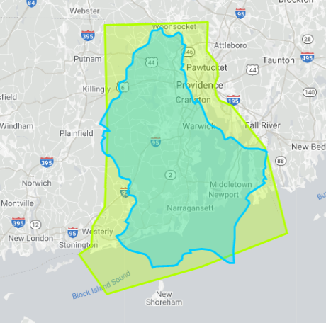

```{css, echo=FALSE}

.level1 {
  min-height: 400px;
  margin-bottom: 4em;
  padding: 1em 2em 2em;
  opacity: 1;
}
.is-active {
  opacity: 1;
  color: #000000;
  background-color: #8e860e;
}
body {
  margin-bottom: 80vh;
  background-color: #002b36;
  color: #93a1a1;
  font-family: 'Fira Code', sans-serif;
}
.sidebar {
    max-width: 40rem;
}
```

```{r, echo=FALSE}
knitr::opts_chunk$set(warning = FALSE)
```

<link rel="preconnect" href="https://fonts.gstatic.com">
<link href="https://fonts.googleapis.com/css2?family=Fira+Code&display=swap" rel="stylesheet">
<script src="https://polyfill.io/v3/polyfill.min.js?features=es6"></script>
<script id="MathJax-script" async src="https://cdn.jsdelivr.net/npm/mathjax@3/es5/tex-mml-chtml.js"></script>

# Before we begin

This document is not an official publication from the Ministry of Health of Luxembourg.
For official data, graphs, and information, go to https://covid19.public.lu/en.html.
This document uses data from the [Open Data Portal](https://data.public.lu/en/datasets/donnees-covid19/).
You can find the source code of this document [here](put link to github repo).

The purpose of this website is to document the spread of the Coronavirus 2019 disease in Luxembourg,
including major events and decisions by the government to fight the spread. I tried to source as 
many claims as possible and, to ensure posterity, only provide links to archived webpages.
This is still a work in progress.

Should you notice mistakes or omissions on this page, you can contact me: bruno [at] brodrigues [dot] co.

If you want to know more about me: https://www.brodrigues.co.
Thank you for reading, and stay healthy.

# Luxembourg

For readers unfamiliar with Luxembourg, here are some statistics about the country, that will help
you understand the numbers and statistics presented below better.

Luxembourg is a landlocked country, squeezed between France, Belgium, and Germany, with a total 
area of $2\,586.4\text{km}^2$, or, in American units, Luxembourg is about $0.955$ Rhode Islands:

```{r, echo=FALSE}

```

As of the 1st of January 2020, Luxembourg has a total population of $626\,108$ residents. It is important
to distinguish between residents, and non-residents; as of January 31st 2020, $476\,562$ people were
employed ([source, PDF warning](https://archive.is/o/6Ycl3/https://igss.gouvernement.lu/dam-assets/publications/tableau-de-bord-emploi/2020/emploi-202001.pdf)), 
of which $206\,818$ were non-residents. Most of these non-residents live very close by the border,
but on the French, Belgian or Germany side of it, and drive everyday to work into Luxembourg.
This fact will become important as I will be discussing statistics and numbers below.

Luxembourg has 3 official languages: Luxembourguish, German and French, so some of the sources
that I use below might not be in English.

One last fun fact: Luxembourg is the only Grand Duchy in the world.

Now that you know the Grand-Duchy of Luxembourg like the palm of your hand, we can start talking
about the spread of Covid19 in the country.

# The first wave

Let's start with what is now considered to be the first wave. There is no official end date of this
wave, so I will be choosing the 1st of June as the end of the first wave.
The first case of corona in Luxembourg was detected on the [29th of February](https://archive.is/fmbAY).
The plot below shows the daily positive cases from the beginning of the epidemic until the 1st 
of June. The red curve is the raw data, and the blue curve is a 7-day moving average. 
You will notice that the graph does not start on the 29th of February, but only on the 16th of March.
This is because the government decided in the summer that it would not report positive cases
from non-residents anymore, and the data was retroactively adjusted. More on this later...

You can use your mouse to hover over the data points and get more details inside a tooltip. 
You can also use the slicer below the plot to "zoom in" a specific time period.

```{r, include=FALSE}
library(dplyr)
library(stringr)
library(lubridate)
library(echarts4r)
library(janitor)

yearMonthDate <- htmlwidgets::JS('function (value) {
  var d = new Date(value);
  var datestring = d.getFullYear() + "-" + ("0"+(d.getMonth()+1)).slice(-2) + "-" + ("0" + d.getDate()).slice(-2)
  return datestring
}')
```

```{r epi-curve, echo = FALSE, fig.cap = "Epidemic curve"}
#covid_data <- data.table::fread("https://data.public.lu/en/datasets/r/767f8091-0591-4b04-9a6f-a9d60cd57159") %>%
covid_data <- data.table::fread("datapublic-covid19.csv") %>%
  clean_names() %>%
  mutate(date = dmy(date)) %>%
  mutate(across(where(is.character), as.numeric)) %>%
  rename_all(~str_remove(., "x1_")) %>%
  mutate(ma_nb_de_positifs = zoo::rollmean(nb_de_positifs, k = 7, fill = 0)) %>%
  mutate(lag_nb_morts = lag(nb_morts, 1)) %>%
  mutate(lag_nb_morts = ifelse(is.na(lag_nb_morts), 0, lag_nb_morts)) %>%
  mutate(morts = nb_morts - lag_nb_morts) %>%
  mutate(nb_cumule_morts = nb_morts,
         nb_morts = morts) %>%
  mutate(`Positives` = nb_de_positifs,
         `Positives (7-day moving average)` = ma_nb_de_positifs,
         `Cumulative deaths` = nb_cumule_morts)

covid_data %>%
  filter(between(date,
                 ymd("2020-02-29"),
                 ymd("2020-06-01"))) %>%  
  e_charts(date) %>%  
  e_line(Positives) %>%
  e_line(`Positives (7-day moving average)`)  %>%  
  e_tooltip("item",
          axisPointer = list(
            type = "cross"
          )) %>%
  e_x_axis(date,
           axisPointer = list(show = TRUE),
           axisLabel = list(
             formatter = yearMonthDate
           )) %>%  
  e_title("Daily positive cases") %>%  
  e_datazoom() %>%
  e_theme("vintage") 
```

During this first wave, the government announced a lockdown on the 15th of March. Schools,
restaurants, bars closed. People that were employed in jobs that could not be done remotely had
to stay home. People that could work from home needed to continue to work, unless they had 
children at home, in which case they were granted a special leave to take care of their children.
This leave was later adjusted so that only one parent at a time could take it. Every person continued
to receive their full wage, whether they were working or not.
Just before the lockdown was announced Luxembourg had its first death on the 13th of March.

```{r, echo = FALSE, fig.cap = "Daily cumulative number of deaths"}
covid_data %>%
  filter(between(date,
                 ymd("2020-02-29"),
                 ymd("2020-06-01"))) %>%  
  e_charts(date) %>%  
  e_line(`Cumulative deaths`) %>%
  e_tooltip("item",
            axisPointer = list(
              type = "cross"
            )) %>%
  e_x_axis(date,
           axisPointer = list(show = TRUE),
           axisLabel = list(
             formatter = yearMonthDate
           )) %>%  
  e_datazoom() %>%
  e_title("Daily cumulative number of deaths") %>%  
  e_theme("vintage")

```

Initially, the lockdown was supposed to only last 2 weeks; however, as the level of daily positive
cases was still high, the lockdown was extended until it was deemed safe enough to slowly reopen
the country. The first sector to reopen was the construction sector, on the 20th of April 
([source, in French](https://archive.is/iFfGB)). It was argued that thanks to the good weather, and
because construction workers are mostly outside, the risk of infection was relatively low. 
Hardware stores were also allowed to reopen on the same day, but any other shop would remain closed
(of course, grocery stores, pharmacies and other shops selling essential goods such as tobacco
and alcohol never closed). Mask mandates were also introduced, and *communes* (the country's lowest 
administrative division) were to start providing 50 masks to their adult inhabitants 
([source (in French)](https://archive.is/D4RB8)).
Pupils in their last year of high school were to go back to school on the 4th of May (until then,
classes were all online), and all the other high school pupils would join them on the 11th of May.
Primary schools and daycarers would open on the 25th of May.
Classes would also be divided into two groups, A and B, and while the A group would go to school for 
one week, group B would attend school from home, and then the week after, B group would go to class
and group A would attend school from home.

At this date, every parent was supposed to go back to work, unless their child, or someone else
from the household, had health issues that could make a COVID19 infection very dangerous. 
Children from health workers were prioritized, and because the number of children that could
go to daycare was also lowered, some people would still need to stay home to take care of their
children. For these parents, the special leave was extended.
All of the strategy is detailed [here (in French)](https://archive.is/Wg480) and [here (in French)](https://archive.is/5mjaT).

Working remotely was still encouraged, but never enforced.

As this wave started, preparations for an ambitious population screening programme, the *Large-scale Testing*
were being made. Up to $20\,000$ people a day could get testing, for free, from May 27th to (initially)
the 28th of July 2020 ([source](https://archive.is/dpVRz)).
The idea was to identify asymptomatic carriers of the virus as early as possible, and thus break
infection chains. People were randomly selected and received an invitation letter at home with a 
unique code that allowed them to book an appointment to get a PCR test.

As can be seen from Figure \@ref(fig:epi-curve), the situation started to get much better around mid-April,
one month after the lockdown.

This is very likely due to the fact that people respected the lockdown and stayed at home. 

```{r mobility, echo = FALSE, fig.cap = "Daily change in time spent at home compared to the baseline period (January 3rd to February 6th 2020)"}
luxembourg <- data.table::fread("2020_LU_Region_Mobility_Report.csv")


luxembourg <- luxembourg %>%
  select(region = country_region, date, contains("percent")) %>%  
  #some very dirty imputation, but looking at the values, probably not very far away from the truth
  mutate(residential_percent_change_from_baseline =
           ifelse(is.na(residential_percent_change_from_baseline), 30,
                  residential_percent_change_from_baseline)) %>%  
  mutate(date = ymd(date)) %>%  
  mutate(`Residential (7-day moving average)` = zoo::rollmean(residential_percent_change_from_baseline, k = 7, fill = NA))


luxembourg %>%
  filter(between(date,
                 ymd("2020-02-29"),
                 ymd("2020-06-01"))) %>%  
  e_charts(date) %>%  
  e_line(`Residential (7-day moving average)`) %>%
  e_tooltip("item",
            axisPointer = list(
              type = "cross"
            )) %>%
  e_x_axis(date,
           axisPointer = list(show = TRUE),
           axisLabel = list(
             formatter = yearMonthDate
           )) %>%  
  e_datazoom() %>%
  e_title("Daily change in\ntime spent at home", 
          "Source: Google mobility data") %>%  
  e_theme("vintage")


```

Figure \@ref(fig:mobility) shows the daily change (in percent) in time spent at home from the 
Google mobility data, which you can find [here](https://www.google.com/covid19/mobility/). 
During the first month of the lockdown, people stayed much more at home than usual, and this
even continued beyond the lockdown. These numbers were very encouraging.

# Things got better, until they weren't

April ended and there were reasons to be optimistic; daily cases were down to less than 10 a day for
the entire month of May, and almost for the entire month of June as well (use the slicer
in the graph below, and see how the situation really got much better during this time). 

With the Large Scale Testing programme that started on the 27th of May, people were reassured
that it would be possible to spend some relatively normal summer months. On the 1st of June,
restaurants, bars and cafés could open again, and things got so well that people were confident enough
to start [drinking again on café terraces](https://archive.is/M9J6a).

On the 29th of June, the A and B groups were to be merged, and complete school classes were to go to school
together again ([source in French](https://archive.is/qdbQU)). The school holidays would start that
year on the 15th of July.

The National Day, held on the 23rd of June, was canceled (this had been announced quite early
in the spring).

```{r epi-curve-summer, echo = FALSE, fig.cap = "Epidemic curve in the summer"}
covid_data %>%
  filter(between(date,
                 ymd("2020-04-15"),
                 ymd("2020-09-15"))) %>%  
  e_charts(date) %>%  
  e_line(Positives) %>%
  e_line(`Positives (7-day moving average)`)  %>%  
  e_tooltip("item",
          axisPointer = list(
            type = "cross"
          )) %>%
  e_x_axis(date,
           axisPointer = list(show = TRUE),
           axisLabel = list(
             formatter = yearMonthDate
           )) %>%  
  e_title("Daily positive cases") %>%  
  e_datazoom() %>%
  e_theme("vintage") 
```

This reopening of the country and return to normal lead to cases increasing again. This was expected,
but what was not expected was the magnitude of the increase. Figure \@ref{fig:epi-curve-summer}
shows that the month of July was pretty bad, almost as bad as the first wave.
Daily positive cases started to increase again, and we were starting the second wave (well, 
we thought that was the second wave, until the real one arrived...), however, during his wave,
there were almost no deaths:

```{r, echo = FALSE, fig.cap = "Daily cumulative number of deaths in the summer"}
covid_data %>%
  filter(between(date,
                 ymd("2020-04-15"),
                 ymd("2020-09-15"))) %>%  
  e_charts(date) %>%  
  e_line(`Cumulative deaths`) %>%
  e_tooltip("item",
            axisPointer = list(
              type = "cross"
            )) %>%
  e_x_axis(date,
           axisPointer = list(show = TRUE),
           axisLabel = list(
             formatter = yearMonthDate
           )) %>%  
  e_datazoom() %>%
  e_title("Daily cumulative number of deaths") %>%  
  e_theme("vintage")

```

From the 1st of May, until the 15th of September, there were 32 deaths in total.
This was very good news, but we had to remain vigilant; the level of daily positive cases
remained quite high during August, and the first half of September.
New restrictions were announced; people could only invite 10 persons at home (before up to 20 
people could have been invited) and controls in restaurants and bars would increase to make sure that
the clients would respect the rules (mask wearing, social distancing... [source](https://archive.is/267as)).
Because Luxembourg was testing so much with the Large Scale Testing (which was never halted and 
continued until the of 2020 and beyond), it was argued that all these positive cases were due to the 
Large Scale Testing. In the introduction I mentioned that Luxembourg's labour force is composed
of 50% of non-residents; however, non-residents working in Luxembourg could also get tested 
as part of the Large Scale Testing programme, and these positive tests were in the official
numbers published by the Ministry of Health. These figures, in turn, are published by the ECDC, the
European Centre for Disease Prevention and Control. 
The ECDC, and many other countries, in an attempt to compare how the pandemic was evolving in 
different countries, requires countries to deliver the positive cases per capita, where positive
cases are all the cases detected in a country, and the denominator part of the equation, the capita, 
is the population of the country. The issue, it was argued, is that Luxembourg has many non-resident
workers, so the metric *positive cases per capita* is flawed. 
[Because the Government could not find an agreement](https://archive.is/aVTYJ) with the ECDC, it 
was decided positive cases for non-residents would not be published anymore in the official
statistics. This explains the discrepancies between earlier press articles announcing a certain
number of positive cases and the open data that you can download today and that I am using for
this document.

Anyhow, things weren't looking so good now, and especially with autumn and winter right around the door...

# The first 6 months

Before continuing this chronicle, let us take a look at the whole epidemic curve until the 15th of 
September:

```{r epi-curve-first-half, echo = FALSE, fig.cap = "Epidemic curve, first 6 months"}
covid_data %>%
  filter(between(date,
                 ymd("2020-02-15"),
                 ymd("2020-09-15"))) %>%  
  e_charts(date) %>%  
  e_line(Positives) %>%
  e_line(`Positives (7-day moving average)`)  %>%  
  e_tooltip("item",
          axisPointer = list(
            type = "cross"
          )) %>%
  e_x_axis(date,
           axisPointer = list(show = TRUE),
           axisLabel = list(
             formatter = yearMonthDate
           )) %>%  
  e_title("Daily positive cases") %>%  
  e_datazoom() %>%
  e_theme("vintage") 
```

and the cumulative deaths until then:

```{r, echo = FALSE, fig.cap = "Daily cumulative number of deaths in the summer"}
covid_data %>%
  filter(between(date,
                 ymd("2020-01-01"),
                 ymd("2020-09-15"))) %>%  
  e_charts(date) %>%  
  e_line(`Cumulative deaths`) %>%
  e_tooltip("item",
            axisPointer = list(
              type = "cross"
            )) %>%
  e_x_axis(date,
           axisPointer = list(show = TRUE),
           axisLabel = list(
             formatter = yearMonthDate
           )) %>%  
  e_datazoom() %>%
  e_title("Daily cumulative number of deaths") %>%  
  e_theme("vintage")

```

To make things short; the first wave hit us, but the very strict lockdown decreased daily
infections to almost 0. This first wave also saw a rapid growth in deaths. The second wave from 
the summer was not so bad, and did not have many deaths. This would change after September 15th.

# Autumn and winter

The date of the 15th of September is important in Luxembourg; it is on this day that a new school
year starts, and this is also when the country goes back to normal. Highways are congested, public
transportation is full of people on the way to work and the weather starts to get bad. This year
was no exception (apart from the weather, that stayed pretty good for some time still).


```{r mobility-winter, echo = FALSE, fig.cap = "Daily change in time spent at home compared to the baseline period (January 3rd to February 6th 2020)"}
luxembourg %>%
  filter(between(date,
                 ymd("2020-02-29"),
                 ymd("2020-10-01"))) %>%  
  e_charts(date) %>%  
  e_line(`Residential (7-day moving average)`) %>%
  e_tooltip("item",
            axisPointer = list(
              type = "cross"
            )) %>%
  e_x_axis(date,
           axisPointer = list(show = TRUE),
           axisLabel = list(
             formatter = yearMonthDate
           )) %>%  
  e_datazoom() %>%
  e_title("Daily change in\ntime spent at home", 
          "Source: Google mobility data") %>%  
  e_theme("vintage")

```

The Google mobility data is unequivocal; after the 15th of September, the daily change in tame spent
at home almost went back to its baseline level. While there were still restrictions in place, as 
well as a mask mandate and remote work being encouraged by the Government, most people spent much, 
much less time at home than during the first wave and the very hard lockdown. The effect can 
be seen here:


```{r epi-curve-second-half, echo = FALSE, fig.cap = "Epidemic curve, autumn and winter 2020"}
covid_data %>%
  filter(between(date,
                 ymd("2020-02-15"),
                 ymd("2020-12-31"))) %>%  
  e_charts(date) %>%  
  e_line(Positives) %>%
  e_line(`Positives (7-day moving average)`)  %>%  
  e_tooltip("item",
          axisPointer = list(
            type = "cross"
          )) %>%
  e_x_axis(date,
           axisPointer = list(show = TRUE),
           axisLabel = list(
             formatter = yearMonthDate
           )) %>%  
  e_title("Daily positive cases") %>%  
  e_datazoom() %>%
  e_theme("vintage") 
```

Cases exploded. This wave is the one people refer to now when they talk about the second wave.
Worse, still, deaths skyrocketed, especially in November:

```{r, echo = FALSE, fig.cap = "Daily cumulative number of deaths in the autumn and winter"}
covid_data %>%
  filter(between(date,
                 ymd("2020-01-01"),
                 ymd("2020-12-31"))) %>%  
  e_charts(date) %>%  
  e_line(`Cumulative deaths`) %>%
  e_tooltip("item",
            axisPointer = list(
              type = "cross"
            )) %>%
  e_x_axis(date,
           axisPointer = list(show = TRUE),
           axisLabel = list(
             formatter = yearMonthDate
           )) %>%  
  e_datazoom() %>%
  e_title("Daily cumulative number of deaths") %>%  
  e_theme("vintage")

```

In the beginning of November, as cases were increasing, our neighbours were already in lockdown,
and the Government [was starting to consider it](https://archive.is/UdNYW). Until then, other measures
had been introduced, such as a [curfew](https://archive.is/VHFRC) at 23:00, and on the 21st of Decembre,
a new lockdown was voted and started on the 26th of Decembre. [Non-essential goods](https://archive.is/1NoE3)
would not be sold anymore, remote work is to preferred whenever possible, the curfew starts at 21:00...
[details here (in French)](https://archive.is/zUuXA).


To be continued...


# Acknowledgments

This page was created using the [R programming language](https://www.r-project.org/) using 
the [`{rmarkdown}`](https://rmarkdown.rstudio.com/) library, and others.
Graphs were made using [`{echarts4r}`](https://echarts4r.john-coene.com/index.html).
Data was downloaded from the [Open Data Portal](https://data.public.lu/en/datasets/donnees-covid19/).

Thank you to all the people that worked to make 2020 less miserably than what it could have been.


# Acknowledgments

This page was created using the [R programming language](https://www.r-project.org/) using 
the [`{rmarkdown}`](https://rmarkdown.rstudio.com/) library, and others.
Graphs were made using [`{echarts4r}`](https://echarts4r.john-coene.com/index.html).
Data was downloaded from the [Open Data Portal](https://data.public.lu/en/datasets/donnees-covid19/).

Thank you to all the people that worked to make 2020 less miserably than what it could have been.

