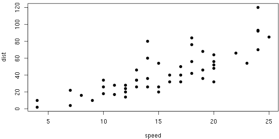
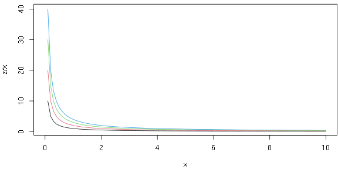

# Introduction

## Level-two heading

Level-two and below headings...

### Level-three

...are all contained in the same section.

### A table


|                  |  mpg| cyl| disp|  hp| drat|    wt|  qsec| vs| am| gear| carb|
|:-----------------|----:|---:|----:|---:|----:|-----:|-----:|--:|--:|----:|----:|
|Mazda RX4         | 21.0|   6|  160| 110| 3.90| 2.620| 16.46|  0|  1|    4|    4|
|Mazda RX4 Wag     | 21.0|   6|  160| 110| 3.90| 2.875| 17.02|  0|  1|    4|    4|
|Datsun 710        | 22.8|   4|  108|  93| 3.85| 2.320| 18.61|  1|  1|    4|    1|
|Hornet 4 Drive    | 21.4|   6|  258| 110| 3.08| 3.215| 19.44|  1|  0|    3|    1|
|Hornet Sportabout | 18.7|   8|  360| 175| 3.15| 3.440| 17.02|  0|  0|    3|    2|
|Valiant           | 18.1|   6|  225| 105| 2.76| 3.460| 20.22|  1|  0|    3|    1|

And no chairs.

# Text

Example text.

No figures or tables in this section. Nothing to display in the main area.

# Plots

You may include any number of plots in a section.


```r
par(mar = c(4, 4, .5, .1))
plot(cars, pch = 19)
```



```r
for (z in 4:1) curve(z/x, 0, 10, add = z < 4, col = z)
```




# Images

Local news [reported](https://www.desmoinesregister.com/story/news/2018/04/27/rubber-duck-des-moines-yess-duck-derby/558852002/) a giant inflatable rubber duck rolling down the street of Des Moines, where this package is conceived.


# Videos

You can also embed videos here.

<iframe width="100%" height="100%" src="https://www.youtube.com/embed/7gYIs7uYbMo" frameborder="0" allow="autoplay; encrypted-media" allowfullscreen></iframe>

# Technical details

The current implementation of this sidebar layout is kind of cumbersome. The HTML template is `rolldown:::pkg_resource('html', 'scrollama-side.html')`. We have hard-coded some CSS and JavaScript code in this template, which means, for example, you cannot easily customize the initialization of Scrollama (if you really want to, you must provide your own HTML template). You should be free to customize CSS, though (like we did in the beginning of this example document).

Activating sections doesn't work well (especially in RStudio Viewer). We don't know why at the moment.
